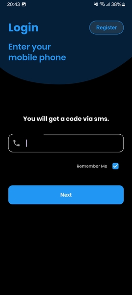
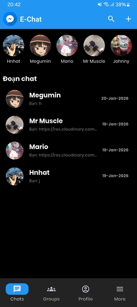
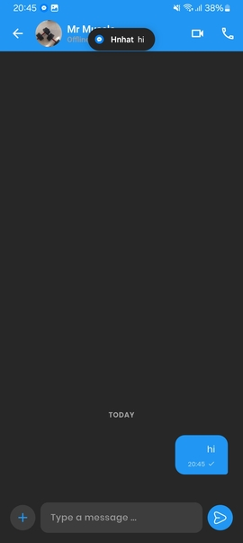
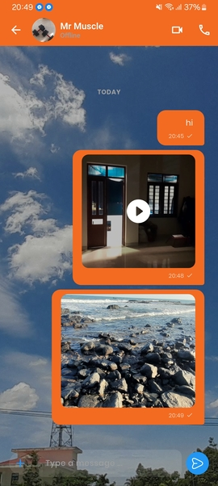
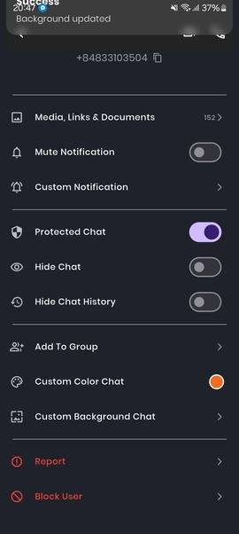
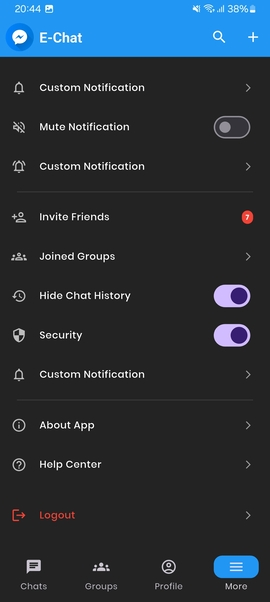
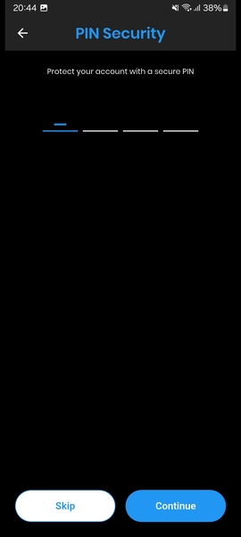

# e-chat-app

Real-Time Messenger App

A full-stack messaging application built with Flutter and Node.js, featuring real-time communication, multimedia sharing, and smart push notifications.

## Screenshots

|  |  |  |  |  |  |  |  |  |  |  |
|:---------------------------------------------:|:---------------------------------------------------:|:---------------------------------------------:|:----------------------------------------------------------------:|:-------------------------------------------------------------------------------------:|:--------------------------------------------------------------------------------:|:-------------------------------------------------:|:----------------------------------------------:|:---------------------------------------------------------------:|:---------------------------------------------------------------------:|:-------------------------------------------------:|


✨ Key Features

The application implements a scalable real-time solution built on a Clean Architecture and GetX for reactive state management.
    + Real-time Messaging: Instant message delivery using Socket.io.
    + Multimedia Sharing: Support for sending images and videos, powered by Cloudinary.
    + Push Notifications: Integration with Firebase Cloud Messaging (FCM) to receive alerts even when the app is closed.
    + User Authentication: Secure JWT-based login and registration.
    + Smart Logic: Notifications are intelligently suppressed when the user is already in the active chat window.

🛠️ Tech Stack & Architecture

| **Mobile Framework** | Flutter (Dart) |

| **State Management** |GetX  |

| **Backend / API** | Node.js |

| **Database & Auth** | MongoDB Atlas |

| **Cloud Services** | Cloudinary |

| **Push Notifications** | Firebase (FCM) & Local Notifications | 

| **Real-time Engine** | Socket.io |

## 🚀 Getting Started

1.  **Clone Repository:**
    ```bash
    git clone https://github.com/1heroflutter/messenger.git
    ```
2.  Environment Config: Create a .env file in the root directory and add your server IP
3.  **Firebase Config:** Place google-services.json in android/app/.
4.  **Pubspec setup:** Ensure .env is added to assets in pubspec.yaml.
5.  Build & Run
